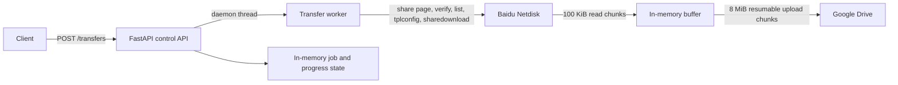

# Baidu Netdisk to Google Drive Transfer

This repository provides a FastAPI service that transfers files from a password-protected Baidu Netdisk shared link to a Google Drive folder.

The data path is **Baidu Netdisk shared link → worker process memory → Google Drive**. Files are read from Baidu in small chunks and uploaded to Google Drive through a resumable-upload session; they are not fully downloaded and staged on the worker's local disk.

## Architecture

The API accepts a transfer request, creates an in-memory job, and starts one background Python thread for the transfer. The worker authenticates the Baidu share using the supplied Baidu browser cookie, verifies the share password embedded in the URL, lists the share recursively, obtains download links, and streams each file to Google Drive.



- `router.py` permits one active job at a time and exposes job status/progress through the API.
- `main.py` contains the transfer orchestration and streaming implementation. It reads Baidu response data in 100 KiB chunks and uploads 8 MiB chunks to a Google Drive resumable-upload URL.
- The Baidu flow fetches the share page, extracts share metadata, calls share init/verify, recursively lists files, refreshes download configuration, and requests download links.
- A folder named after the Baidu share root is found or created under the supplied Google Drive folder. Existing direct children of that folder are listed and files with matching filenames are skipped.

## Main files

| File | Responsibility |
| --- | --- |
| `router.py` | FastAPI application, API models, in-memory job registry, background worker thread, and cancellation endpoint. |
| `main.py` | Baidu-to-Google transfer orchestration, progress reporting, cooperative cancellation, duplicate-name skipping, and streaming upload. |
| `baidu_share_transfer.py` | Baidu share URL parsing, metadata extraction, password verification, recursive listing, download configuration, and download-link requests. It also has a standalone diagnostic entry point. |
| `google_drive_upload.py` | Google OAuth credential loading, Google Drive folder ID parsing, and standalone local-file upload helpers. |
| `Dockerfile` | Python 3.12 slim API image; runs Uvicorn on port `8005`. |
| `.github/workflows/deploy.yml` | Builds and pushes a Linux/AMD64 image, then deploys it to Cloud Run. |

## API

Interactive API documentation is available at `/docs` while the service is running.

### `POST /transfers`

Starts a transfer in a background thread. Only one job may be pending or running; a second request receives `409 Conflict`.

```bash
curl -X POST http://localhost:8005/transfers \
  -H 'Content-Type: application/json' \
  -d '{
    "baidu_url": "https://pan.baidu.com/s/<share-token>?pwd=<password>",
    "google_folder_url": "https://drive.google.com/drive/folders/<folder-id>"
  }'
```

Response (`202 Accepted`):

```json
{
  "job_id": "550e8400-e29b-41d4-a716-446655440000",
  "status": "pending"
}
```

### `GET /transfers/active`

Returns whether an active job exists. When one exists, its full job model is returned.

```json
{
  "active": true,
  "job": {
    "job_id": "550e8400-e29b-41d4-a716-446655440000",
    "status": "running",
    "created_at": "2026-09-19T10:00:00+00:00",
    "started_at": "2026-09-19T10:00:01+00:00",
    "finished_at": null,
    "error": null,
    "total_files": 3,
    "total_bytes": 123456789,
    "baidu_downloaded_bytes": 1048576,
    "baidu_completed_files": 0,
    "baidu_percent": 0.85,
    "baidu_speed": 123456.0,
    "google_uploaded_bytes": 0,
    "google_completed_files": 0,
    "google_percent": 0.0,
    "google_speed": 0.0
  }
}
```

When no transfer is active, the response is `{"active": false}`.

### `GET /transfers/{job_id}`

Returns the same full job model shown above. Unknown IDs return `404`.

```bash
curl http://localhost:8005/transfers/550e8400-e29b-41d4-a716-446655440000
```

### `POST /transfers/{job_id}/cancel`

Requests cancellation of a pending or running job.

```bash
curl -X POST \
  http://localhost:8005/transfers/550e8400-e29b-41d4-a716-446655440000/cancel
```

```json
{
  "job_id": "550e8400-e29b-41d4-a716-446655440000",
  "status": "running",
  "cancel_requested": true
}
```

Supported job statuses are `pending`, `running`, `completed`, `failed`, and `cancelled`.

### Cancellation behavior

Cancellation is cooperative; the API sets a `threading.Event` and does not forcefully terminate the Python thread. The transfer checks this event before download-link batches and upload-session creation, while reading Baidu chunks, and before Google chunk uploads. A request already in progress (for example, an HTTP upload) finishes or fails before the worker reaches its next cancellation checkpoint.

## Configuration and secrets

| Setting | Required | Behavior |
| --- | --- | --- |
| `BAIDU_COOKIE` | Yes | Authenticated Baidu browser cookie used for the share flow. |
| `GOOGLE_CREDENTIALS_FILE` | When no valid token is available | OAuth client credentials path. Defaults to `credentials.json`. |
| `GOOGLE_TOKEN_FILE` | No | Authorized-user token path. Defaults to `token.json`. |
| `GOOGLE_TOKEN_WRITABLE` | No | When `true` (default), writes the current/refreshed OAuth token to `GOOGLE_TOKEN_FILE`; set `false` for a read-only token mount. |

Google Drive access uses the full `https://www.googleapis.com/auth/drive` OAuth scope. If the token is missing or invalid, the code starts the installed-app OAuth flow and opens a local callback server. For unattended/container deployments, provide a valid authorized-user token rather than relying on this interactive flow.

Never commit Baidu cookies, Google OAuth credentials, OAuth tokens, or deployment secrets to Git. Use environment variables and platform secret storage; never bake secrets into an image.

## Local development

The project uses the versions pinned in `requirements.txt`.

```bash
python3 -m venv .venv
source .venv/bin/activate
pip install -r requirements.txt

export BAIDU_COOKIE='<authenticated-baidu-cookie>'
export GOOGLE_CREDENTIALS_FILE="$PWD/credentials.json"
export GOOGLE_TOKEN_FILE="$PWD/token.json"

python -m uvicorn router:app --host 0.0.0.0 --port 8005
```

Open <http://localhost:8005/docs> for the OpenAPI UI.

For the implemented command-line transfer entry point, use:

```bash
python main.py \
  'https://pan.baidu.com/s/<share-token>?pwd=<password>' \
  'https://drive.google.com/drive/folders/<folder-id>' \
  --mode all
```

`--mode test` (the CLI default) transfers only the first listed file; the API always invokes `--mode all` behavior.

## Docker

The Dockerfile copies the service source files, installs `requirements.txt`, exposes port `8005`, and starts `router:app` with Uvicorn.

```bash
docker build -t baidu-drive-transfer .
mkdir -p .runtime-google

docker run --rm -p 8005:8005 \
  -e BAIDU_COOKIE='<authenticated-baidu-cookie>' \
  -e GOOGLE_CREDENTIALS_FILE=/secrets/credentials.json \
  -e GOOGLE_TOKEN_FILE=/state/token.json \
  -e GOOGLE_TOKEN_WRITABLE=true \
  -v "$PWD/credentials.json:/secrets/credentials.json:ro" \
  -v "$PWD/.runtime-google:/state" \
  baidu-drive-transfer
```

If an authorized `token.json` is already available and must remain read-only, mount it at the configured token path and use `GOOGLE_TOKEN_WRITABLE=false`. Keep the credentials and token files outside the build context or otherwise ensure they are not copied into the image.

## Deployment

`.github/workflows/deploy.yml` runs on pushes to `main` and uses GitHub Actions OIDC authentication through `google-github-actions/auth`. The workflow reads the Workload Identity Provider and deployment service account from GitHub secrets, logs into Artifact Registry with the resulting access token, builds a `linux/amd64` image, pushes SHA-tagged and `latest` images, and deploys to Cloud Run.

The current workflow configuration is:

| Item | Value |
| --- | --- |
| Google Cloud project | `andessence-backend-service` |
| Artifact Registry region | `asia-east1` |
| Artifact Registry repository/image | `baidu-drive-transfer/baidu-drive-transfer` |
| Cloud Run region | `asia-northeast1` |
| Cloud Run service | `baidu-drive-transfer-test` |

The workflow deploys only the image; it does not configure the runtime Baidu cookie or Google OAuth files. Configure those separately with Cloud Run environment variables, mounted/managed secrets, and a suitable writable token location if token refreshes are enabled.

## Current limitations and operational notes

- Exactly one active transfer is supported per application process. The design assumes one worker process/instance for a coherent active-job view.
- Jobs, progress, and cancellation events are stored only in memory. Restarting the service loses API job state and no job history is persisted.
- Cancellation is cooperative, not a forced thread stop.
- Files are listed recursively from Baidu, but the implementation uploads them into one Google Drive folder named after the Baidu share root; it does not recreate the Baidu directory hierarchy.
- Existing-file detection considers only direct children of that Google folder and matches filenames only. Matching names are skipped, even if file contents or sizes differ; same-named files from different Baidu directories can therefore collide.
- The streaming buffer is memory-resident and can grow up to an upload chunk plus incoming data; no full local-file staging is implemented.
- The implementation has no persisted queue, distributed locking, retry policy, or multi-instance coordination.

## Security notes

Treat `BAIDU_COOKIE`, Google OAuth client credentials, and Google OAuth tokens as secrets. Provide them through environment variables or deployment secret storage, restrict access to their files, and do not include them in Git commits, logs, or Docker images.
